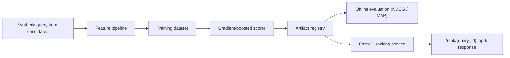

# ranking-serving-engine

A local-first ranking system that generates query-item candidates, trains a feature-based scorer, evaluates relevance quality with ranking metrics, and serves top-k results through a low-latency API.

## Problem

Recommendation and search systems are not just "train a model and hope." A credible ranking stack needs candidate features, a reproducible offline evaluation path, an artifact-backed serving layer, and a clean way to inspect what the top-k API is actually doing. This repo focuses on that end-to-end ranking workflow.

## Architecture

The V1 implementation keeps the stack laptop-runnable while still reflecting a real serving shape:

- deterministic synthetic query-item candidates simulate a personalization workload
- a feature pipeline computes affinity, freshness, price fit, and popularity signals per candidate
- a gradient-boosted rank scorer is trained on query-grouped relevance labels
- offline evaluation computes NDCG@5 and MAP@5 on held-out queries
- a serving layer loads trained artifacts and returns top-k ranked items for a query



## Tradeoffs

This V1 makes three deliberate tradeoffs:

1. The repo uses deterministic synthetic ranking data instead of a large behavioral log so the full workflow is reproducible locally.
2. The scorer is a scikit-learn gradient boosting model rather than a heavier dedicated ranking library because local runnability matters more than squeezing a few extra points from V1.
3. Serving uses artifact-backed in-memory ranking rather than Redis or a feature store so the repo stays focused on ranking logic and response shape before adding infrastructure depth.

## Repo Layout

```text
ranking-serving-engine/
├── app/
│   ├── cli.py
│   ├── dataset.py
│   ├── evaluation.py
│   ├── main.py
│   ├── service.py
│   └── training.py
├── artifacts/
└── tests/
```

## Run Steps

### Install Dependencies

```bash
git clone git@github.com:srn91/ranking-serving-engine.git
cd ranking-serving-engine
python3 -m pip install -r requirements.txt
```

### Train the Ranker

```bash
make train
```

That produces:

- `artifacts/model.joblib`
- `artifacts/ranking_dataset.json`
- `artifacts/metadata.json`

### Evaluate Ranking Quality

```bash
make evaluate
```

### Start the Ranking API

```bash
make serve
```

Useful endpoints:

- `http://127.0.0.1:8002/health`
- `http://127.0.0.1:8002/queries`
- `http://127.0.0.1:8002/rank/query_0001?k=5`

### Run the Full Quality Gate

```bash
make verify
```

## Validation

The V1 repo currently verifies:

- deterministic generation of grouped ranking candidates
- artifact-backed training and serving with no hidden retraining in the API
- offline NDCG@5 and MAP@5 computation on held-out queries
- top-k serving for known queries using the stored artifact package

Current expected evaluation snapshot:

- queries evaluated: `12`
- NDCG@5: at least `0.93`
- MAP@5: at least `0.88`
- served query path returns ranked items with feature and score context

Local quality gates:

- `make lint`
- `make test`
- `make train`
- `make evaluate`
- `make verify`

## Current Capabilities

The V1 repo demonstrates:

- deterministic ranking candidate generation
- feature-based scoring with gradient boosting
- grouped offline ranking metrics
- artifact-backed top-k serving through FastAPI
- explicit train/evaluate/serve separation so API behavior is reproducible

## Next Steps

Realistic follow-up work for the next milestone:

1. replace synthetic labels with logged-click or impression-style training data
2. add a lightweight cache or feature-store layer for serving features
3. compare multiple ranking models and track experiment metadata
4. add diversity or freshness-aware reranking constraints
5. log feedback events for future online-learning or retraining workflows
