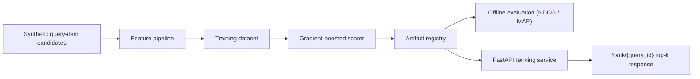

# ranking-serving-engine

A local-first ranking system that generates query-item candidates, trains a feature-based scorer, evaluates relevance quality with ranking metrics, and serves top-k results through a FastAPI endpoint.

## Problem

Recommendation and search systems are not just "train a model and hope." A credible ranking stack needs candidate features, a reproducible offline evaluation path, an artifact-backed serving layer, and a clean way to inspect what the top-k API is actually doing. This repo focuses on that end-to-end ranking workflow.

## Architecture

The V1 implementation keeps the stack laptop-runnable while still reflecting a real serving shape:

- deterministic synthetic query-item candidates simulate a personalization workload
- a feature pipeline computes affinity, freshness, price fit, and popularity signals per candidate
- a gradient-boosted rank scorer is trained on query-grouped relevance labels
- offline evaluation computes NDCG@5 and MAP@5 on held-out queries
- a serving layer loads trained artifacts and returns top-k ranked items for a query

## Pipeline Walkthrough

The ranking path is split so the offline and online stories stay easy to reason about:

1. `app/dataset.py` generates query-grouped candidates and labels.
2. `app/training.py` fits the rank scorer and writes the artifact bundle.
3. `app/evaluation.py` computes grouped ranking metrics from the saved predictions.
4. `app/service.py` loads the registered model and ranks query items without retraining.
5. `app/main.py` serves the health, query index, and `/rank/{query_id}` endpoints.

The serving layer is intentionally artifact-backed and retraining-free. That keeps the request path predictable and makes it obvious where to add explicit latency instrumentation or caching later, rather than hiding those concerns inside the model code.



## Tradeoffs

This V1 makes three deliberate tradeoffs:

1. The repo uses deterministic synthetic ranking data instead of a large behavioral log so the full workflow is reproducible locally.
2. The scorer is a scikit-learn gradient boosting model rather than a heavier dedicated ranking library because local runnability matters more than squeezing a few extra points from V1.
3. Serving uses artifact-backed in-memory ranking rather than Redis or a feature store so the repo stays focused on ranking logic and response shape before adding infrastructure depth.

## Repo Layout

```text
ranking-serving-engine/
├── app/
│   ├── cli.py
│   ├── dataset.py
│   ├── evaluation.py
│   ├── main.py
│   ├── service.py
│   └── training.py
├── artifacts/
└── tests/
```

## Run Steps

### Install Dependencies

```bash
git clone https://github.com/srn91/ranking-serving-engine.git
cd ranking-serving-engine
python3 -m pip install -r requirements.txt
```

### Train the Ranker

```bash
make train
```

That produces:

- `artifacts/model.joblib`
- `artifacts/ranking_dataset.json`
- `artifacts/metadata.json`

### Evaluate Ranking Quality

```bash
make evaluate
```

### Start the Ranking API

```bash
make serve
```

Useful endpoints:

- `http://127.0.0.1:8002/health`
- `http://127.0.0.1:8002/queries`
- `http://127.0.0.1:8002/rank/query_0049?k=5`

The served ranking response now includes a `freshness_constraint` block and a `served_score` per row so you can see when the request path promoted fresher candidates into the top-k window.

### Run the Full Quality Gate

```bash
make verify
```

## Hosted Deployment

- Live URL: [https://ranking-serving-engine.onrender.com](https://ranking-serving-engine.onrender.com)
- First path to click: `/queries`, then `/rank/query_0049?k=5`
- Browser smoke: passed on `/rank/query_0049?k=5`; direct HTTP to `/queries` and `/rank/query_0049?k=5` returned `200`
- Render config: Git-backed Python web service on `main`, `buildCommand=python3 -m pip install -r requirements.txt`, `startCommand=uvicorn app.main:app --host 0.0.0.0 --port $PORT`, `healthCheckPath=/health`, `plan=free`, `region=oregon`, auto-deploy enabled

## Validation

The V1 repo currently verifies:

- deterministic generation of grouped ranking candidates
- artifact-backed training and serving with no hidden retraining in the API
- offline NDCG@5 and MAP@5 computation on held-out queries
- top-k serving for known queries using the stored artifact package
- a freshness-aware serving constraint can promote fresher candidates into top-k when the base scorer over-concentrates on stale results

The evaluation surface is intentionally inspectable:

- NDCG@5 shows whether the top of the list is ordered correctly.
- MAP@5 shows whether relevant items are surfaced early and consistently.
- The `/rank/{query_id}` response includes the item score plus feature context so the ranking decision can be inspected instead of treated as a black box.

Operational target:

- keep the request path artifact-backed, in-process, and free of retraining
- add explicit P50/P99 telemetry if you want to present published latency SLOs later

Current expected evaluation snapshot:

- queries evaluated: `12`
- NDCG@5: at least `0.93`
- MAP@5: at least `0.88`
- served query path returns ranked items with feature and score context
- served top-k can include freshness-based promotions while still exposing the underlying model score

Local quality gates:

- `make lint`
- `make test`
- `make train`
- `make evaluate`
- `make verify`

## Current Capabilities

The V1 repo demonstrates:

- deterministic ranking candidate generation
- feature-based scoring with gradient boosting
- grouped offline ranking metrics
- artifact-backed top-k serving through FastAPI
- explicit train/evaluate/serve separation so API behavior is reproducible
- freshness-aware reranking constraints at serve time without retraining the model

## Future Expansion

Possible follow-on work outside the current shipped scope:

1. replace synthetic labels with logged-click or impression-style training data
2. add a lightweight cache or feature-store layer for serving features
3. compare multiple ranking models and track experiment metadata
4. add diversity constraints alongside freshness so the serving policy can balance both objectives
5. log feedback events for future online-learning or retraining workflows
