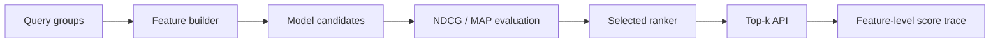

# Ranking Serving Engine - System Brief

## Problem

Ranking systems need more than a scoring function. They need feature preparation, model comparison, query-level evaluation, top-k serving, freshness guards, and traceable outputs so ranking decisions can be inspected.

## System Design



## Stack

- Python, FastAPI, pytest
- Ranking feature generation
- NDCG@5 and MAP@5 evaluation
- Top-k serving and feature-level trace output

## Metrics

- `12` query groups
- Model selection by NDCG@5 then MAP@5
- Freshness threshold and required fresh-result checks
- Feature-level traces for served ranking output

## Run

```bash
make setup
make test
make serve
```

Live demo: https://ranking-serving-engine.onrender.com

## Production Scale Improvements

- Add offline feature backfills from warehouse snapshots.
- Add online latency metrics by query type and candidate count.
- Extend evaluation to segment-level metrics and counterfactual checks.
- Add shadow ranking before switching production rankers.
